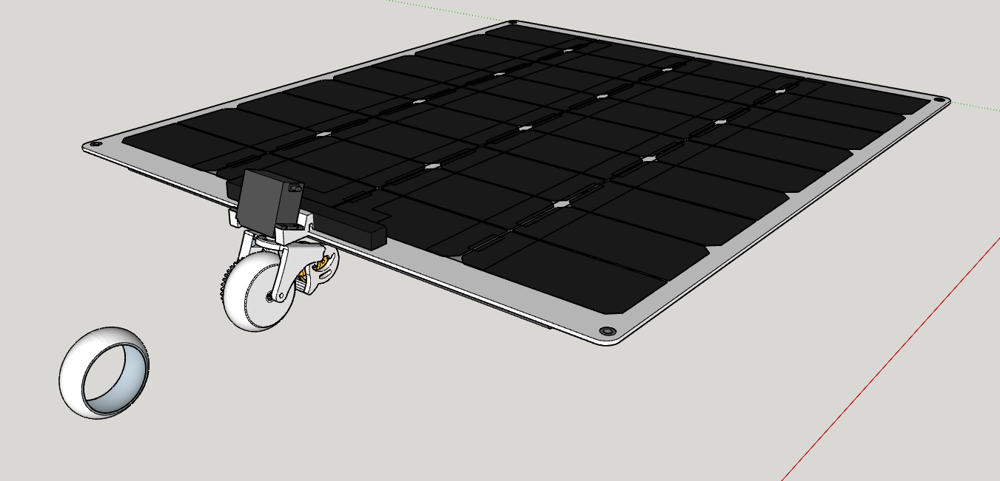
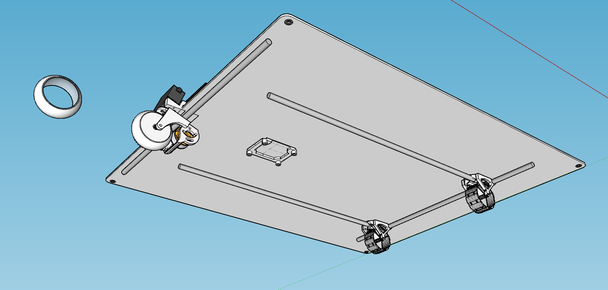

# FrankyTank

Coche solar creado para la competición de la Regata Solar organizada por Marine Instruments

## Hardware
- Arduino Nano
- Placa personalizada ([PCB_RControl](https://github.com/OPRobots/PCB_RControl)) al igual que en el Barco Solar [SunnyGo](https://github.com/OPRobots/SunnyGo)
- Goma de ruedas de silicona "casteadas" directamente sobre las llantas.
- Chasis impreso en PLA con refuerzos de tubos huecos de fibra de carbono.

## Software
- Programamos el habitual algoritmo MPPT, algunos filtros para los sensores, aceleraciones, la inicialización del Brushless, y el tratamiento de las señales del mando con nuestro software [SolarController](https://github.com/OPRobots/SolarController).